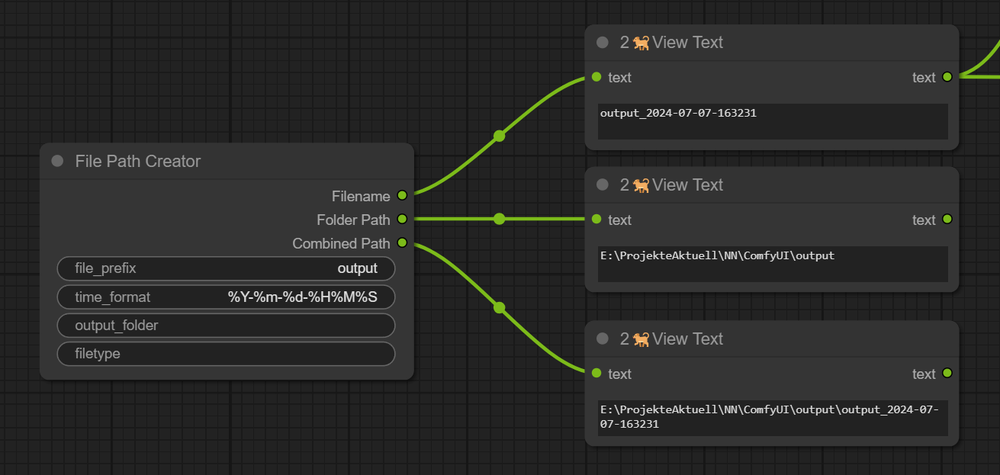

# ComfyUI-FilePathCreator

## Overview
The `ComfyUI-FilePathCreator` is a custom node extension for ComfyUI designed to generate dynamic filenames based on user-defined parameters. This node helps streamline the process of creating organized and timestamped filenames, ideal for saving output files in a structured manner.

## Features
- **Customizable Filename Prefix**: Define a custom prefix for your filenames to easily identify and categorize your files.
- **Dynamic Timestamps**: Generate filenames with current timestamps using customizable time formats.
- **Optional Output Folder**: Specify an output folder where files should be saved. If not specified, a default local output folder is used.
- **File Type Specification**: Choose the file extension for the generated filenames. If the file type is left empty, the filename is generated without an extension.

## Inputs
1. **file_prefix** (required): 
   - Type: STRING
   - Default: `"output"`
   - Description: The prefix to be used for the generated filename.

2. **time_format** (required):
   - Type: STRING
   - Default: `"%Y-%m-%d-%H%M%S"`
   - Description: The format for the timestamp in the filename. Uses Python's `datetime` format codes.

3. **output_folder** (optional):
   - Type: STRING
   - Default: `""`
   - Description: The folder path where the file should be saved. Defaults to a local "output" folder if left empty.

4. **filetype** (optional):
   - Type: STRING
   - Default: `"txt"`
   - Description: The file extension for the generated filename. If left empty, no file extension is added.

## Outputs
1. **Filename**: The generated filename based on the prefix and timestamp.
2. **Folder Path**: The path of the output folder.
3. **Combined Path**: The full path combining the output folder and filename.

## Example Usage
After installing the `ComfyUI-FilePathCreator`, you can use it to generate filenames like `output_2023-07-07-143022.txt` and save them in a specified folder. This is particularly useful for batch processing or saving results from automated workflows in a consistent and organized manner.

## FilePathExtractor

### Overview
The `FilePathExtractor` is a custom node extension for ComfyUI designed to extract components from a given file or folder path. This node facilitates the decomposition of file paths into understandable and reusable parts, enhancing workflow automation and path management.

### Features
- **Path Input**: Accepts a path to a file or folder.
- **Extract File Name**: Retrieves the name of the file without the extension.
- **Extract File Extension**: Identifies the file's extension.
- **File Name With Extension**: Retrieves the filename along with its extension.
- **Extract Folder Name**: Gets the name of the folder containing the file.
- **Extract Folder Path**: Provides the absolute path to the folder.

### Inputs
1. **path** (required): 
   - Type: STRING
   - Default: `""`
   - Description: The path to a file or folder from which to extract information.

### Outputs
1. **File Name**: The name of the file extracted from the path.
2. **File Extension**: The extension of the file.
3. **File Name With Extension**: The filename along with its extension.
4. **Folder Name**: The name of the folder containing the file.
5. **Folder Path**: The absolute path to the folder.

### Example Usage
After installing the `FilePathExtractor`, you can input a file path like `C:/Users/Username/Documents/report.pdf` and obtain:
- **File Name**: `report`
- **File Extension**: `pdf`
- **File Name With Extension**: `report.pdf`
- **Folder Name**: `Documents`
- **Folder Path**: `C:/Users/Username/Documents`

## Licensing
This project is licensed under the MIT License. See the LICENSE file for more details.

## Contributions
Contributions are welcome! Please feel free to submit a pull request or open an issue on the GitHub repository.
